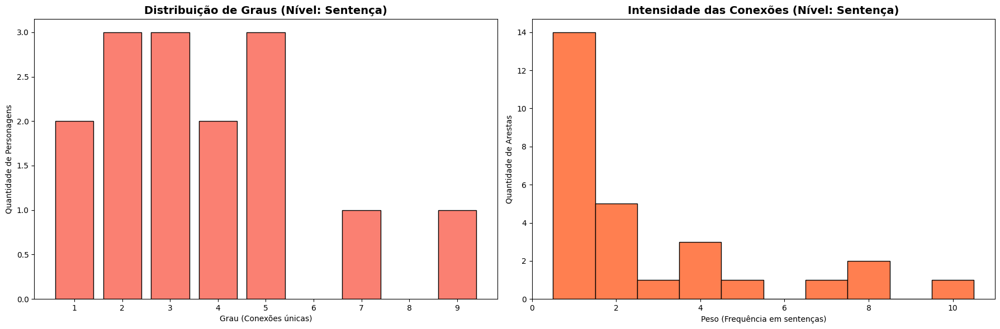
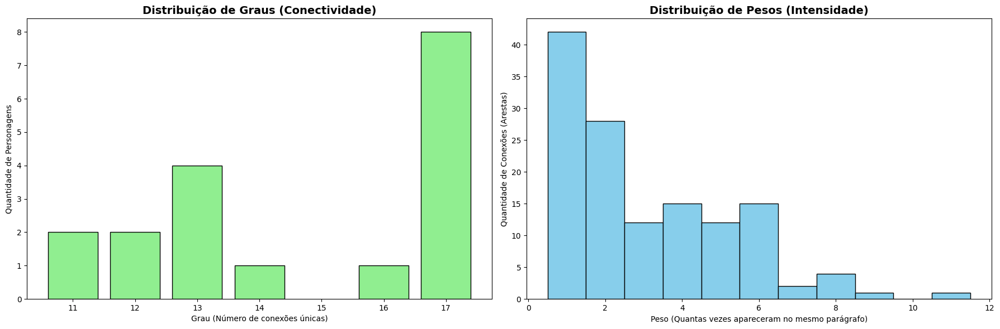
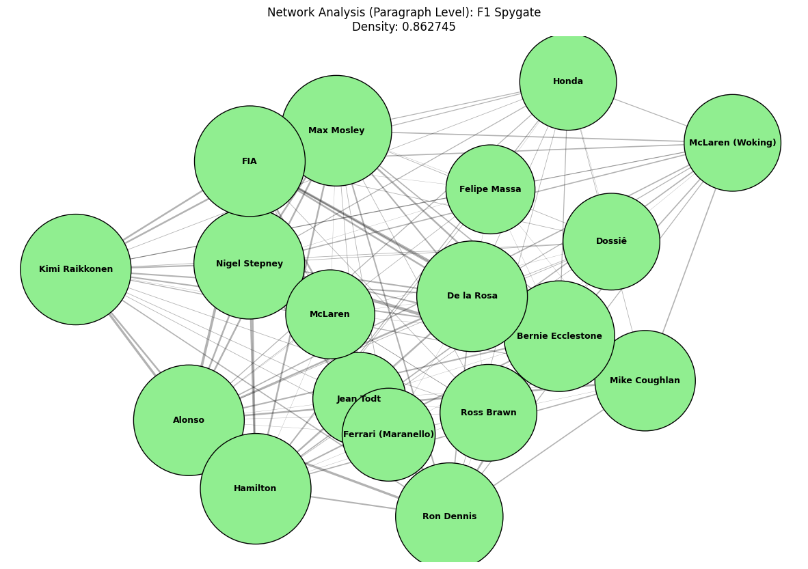
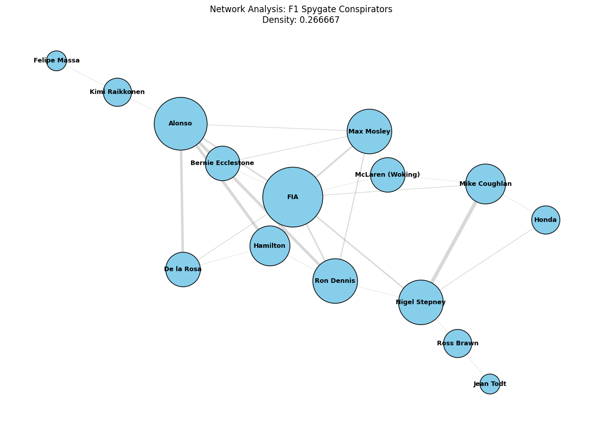

# Análise de Rede do Escândalo Spygate da Fórmula 1 (2007)

## Integrantes

- **Carlos Silvano de Oliveira Júnior**
- **Félix Luiz Garção Filho**
- **Pedro Henrique da Silva Paixão**

---


## Objetivo do Projeto

Analisar a rede de relacionamentos entre os principais atores do escândalo **Spygate** (F1 2007) aplicando conceitos de **Algoritmos e Estrutura de Dados II**. O projeto utiliza **Processamento de Linguagem Natural (NLP)** e **Análise de Redes** para extrair e visualizar conexões entre pessoas, equipes e organizações mencionadas em vídeos sobre o escândalo.

### Etapas do Desenvolvimento

1. **Coleta e Preparação**: Extração de vídeos do YouTube e transcrição com **OpenAI Whisper**
2. **NLP com spaCy**: Extração de entidades nomeadas (NER) e normalização de referências
3. **Construção de Grafo**: Implementação com **NetworkX** (grafos em nível de sentença e parágrafo)
4. **Análise de Rede**: Cálculo de centralidade (degree, betweenness, closeness, eigenvector)
5. **Visualização**: Exportação em GraphML, GEXF e gráficos com **Matplotlib**


---

## Principais Resultados Obtidos

### Artefatos Produzidos

- **Transcrições**: `merged_transcripts_v2.txt`, `transcribed/` (6 vídeos individuais)
- **Grafos**: `grafos/spygate_graph_en_sentenca.graphml`, `spygate_graph_pt-paragrafos.graphml`, e formatos GEXF
- **Notebooks**: `AED2.ipynb` (principal), `merged.ipynb`, `transcricao.ipynb`

### Visualizações Principais

#### Análise em Nível de Sentença


#### Análise em Nível de Parágrafo


#### Grafo da Rede (Nível de Parágrafo - Densidade: 0.863)


#### Grafo de Conspiradores (Nível de Sentença - Densidade: 0.267)


---

## Análise e Discussão dos Achados

### Insights Principais

- **Atores Centrais**: Nigel Stepney, Mike Coughlan, Ron Dennis, Fernando Alonso e Lewis Hamilton
- **McLaren como Hub**: Equipe atua como ponto central de conexão na rede
- **Polarização Ferrari-McLaren**: Dicotomia clara entre as organizações
- **Papel da FIA**: Funciona como intermediária entre múltiplos atores
- **Alta Densidade na Rede**: A rede em nível de parágrafo apresenta densidade de 0.863, indicando forte interconexão entre atores principais

### Conceitos Aplicados

**Grafos** • **Análise de Centralidade** • **NLP** • **Processamento de Dados em Larga Escala** • **Busca em Grafos**

---

## Tecnologias Utilizadas

- **Python 3.12**: Linguagem principal
- **OpenAI Whisper**: Transcrição de áudio
- **spaCy**: Processamento de Linguagem Natural e NER
- **NetworkX**: Construção e análise de grafos
- **Matplotlib**: Visualização de gráficos
- **yt-dlp**: Download de vídeos do YouTube
- **Jupyter Notebook**: Ambiente de desenvolvimento e documentação

### Dependências

```
openai-whisper
yt-dlp
spacy
networkx
matplotlib
```

Para instalar as dependências:
```bash
pip install -r requirements.txt
```

---

## Como Usar o Projeto

```bash
# Instalar ambiente
python -m venv venv
venv\Scripts\activate  # Windows
source venv/bin/activate  # Linux/Mac
pip install -r requirements.txt

# Baixar modelos spaCy
python -m spacy download en_core_web_sm pt_core_news_sm
```

**Executar**: Abra `AED2.ipynb` no Google Colab ou Jupyter localmente.

**Visualizar Grafos**: Use Gephi ou NetworkX para os arquivos em `grafos/`.

---

## Estrutura do Repositório

```
NER-ED2/
├── README.md                          # Este arquivo
├── requirements.txt                   # Dependências do projeto
├── AED2.ipynb                        # Notebook principal de análise
├── merged.ipynb                      # Análises complementares
├── transcricao.ipynb                 # Processamento de transcrições
├── LICENSE                           # Licença do projeto
├── merged_transcripts_v2.txt         # Transcrições consolidadas (v2)
├── merged_transcripts.txt            # Transcrições consolidadas (v1)
├── spygate_graph.graphml             # Grafo do Spygate (formato GraphML)
├── transcribed/                      # Pasta com transcrições individuais
│   ├── ENTENDA O ESCÂNDALO DE ESPIONAGEM DA F1 EM 2007...
│   ├── O Maior Escândalo de Roubo da História da F1...
│   └── ... (outros vídeos transcritos)
└── grafos/                           # Pasta com diferentes representações de grafos
    ├── spygate_graph_en_sentenca.graphml
    ├── spygate_graph_pt-paragrafos.graphml
    ├── spygate_paragrafo.gexf
    └── spygate_sentenca.gexf
```

---

## Vídeo de Apresentação

Para uma apresentação completa do projeto, metodologia e resultados, assista ao vídeo de apresentação:

🎥 **[Apresentação do Projeto - Loom](https://www.loom.com/share/e975abca2560490688b2fc65da5162a4)**


---

## Licença

Este projeto é fornecido sob a licença MIT. Veja o arquivo [LICENSE](LICENSE) para mais detalhes.

---

**Data de conclusão**: 2026  
**Disciplina**: Algoritmos e Estrutura de Dados II
